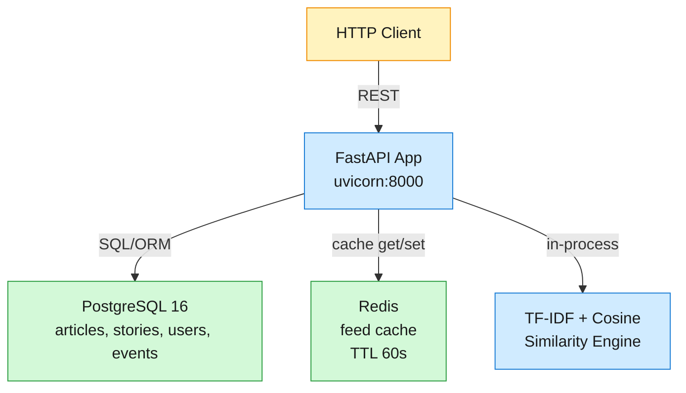

# Google News MVP — Architecture Design

Derived from `docs/system-design.md`, scoped to MVP per `SPEC.md`.

## 1. Architecture Overview

A single-service FastAPI monolith backed by PostgreSQL and Redis, deployed via Docker Compose. Articles flow: ingest → cluster into stories → rank per user → serve as feed.



**Data flow for feed request (FR-1):**
1. `GET /v1/feed?user_id=X` → router calls `feed_service`
2. Service checks Redis cache key `feed:{user_id}:{region}:{preferences_hash}` (TTL 60s)
3. On cache miss: load user prefs → query recent stories (last 48h) → compute score per story → sort → cache
4. Score = e^(-λ × hours_age) × source_authority × topic_boost
5. Return top 30 stories with headline, snippet, source count, thumbnail placeholder

**Data flow for article ingestion (FR-5):**
1. `POST /v1/articles` → router validates → calls `article_service`
2. Check URL uniqueness → 409 on duplicate
3. Insert article row (story_id = NULL initially)
4. Call `cluster_service.assign_story(article)`:
   - Fetch all unassigned articles from last 24h
   - Build TF-IDF matrix against current article's headline + snippet
   - Compute cosine similarity; if > 0.35 threshold, assign to best-match story
   - If no match above threshold, create new Story
5. Update story counters (article_count, top_sources, canonical_headline)
6. Invalidate affected feed cache keys
7. Return article_id + story_id

## 2. Stack & Rationale

| Component | Choice | Why |
|---|---|---|
| Runtime | Python 3.12, FastAPI, uvicorn | Async native, Pydantic v2 validation, app factory + lifespan pattern. |
| Primary DB | PostgreSQL 16 | Rich indexing (GIN for FTS, B-tree for time/domain), transactional DDL via Alembic. |
| Cache | Redis 7 | Feed cache with TTL; simple get/set, no LUA scripting needed for MVP. |
| Search | PostgreSQL full-text search (`tsvector`/`tsquery`) | Avoids Elasticsearch operational overhead; sufficient for MVP corpus size (~100K articles). |
| Clustering | TF-IDF + cosine similarity (scikit-learn) | In-process, no distributed infra. scikit-learn's `TfidfVectorizer` is mature. Works for MVP volumes. |
| Container | Docker Compose (app + db + redis) | Reproducible local dev + CI; single command bring-up. |
| Migrations | Alembic | Declarative, reversible, works with async SQLAlchemy. |
| Config | pydantic-settings | Typed env vars, `.env` support, Docker-friendly. |

**Decision — PostgreSQL FTS over Elasticsearch:**
- Pro: zero additional service, simpler deploy, transactions couple search index with article writes.
- Con: no stemming customization, weaker relevance tuning, no distributed search.
- Rationale: MVP corpus is small (seed data, not 50K sources). Migrate to Elasticsearch only when full-text latency exceeds 100ms or recall degrades. WhatsApp uses SQLite FTS5 in MVP; we follow the same "boring until proven insufficient" pattern.

**Decision — In-process TF-IDF over distributed MinHash/LSH:**
- Pro: no new infrastructure, simple code, easy to debug.
- Con: O(n²) comparison per clustering batch; breaks down beyond ~10K articles/batch.
- Rationale: MVP ingests articles one-at-a-time, comparing against a 24h window of at most few hundred articles. In-process is fast enough (sub-100ms for ~200 articles). Revisit MinHash/LSH in Phase 2 when ingestion goes streaming/batch.

## 3. Data Model

```python
# ── Article ──────────────────────────────────────────────────────
class Article(Base):
    __tablename__ = "articles"

    article_id:      Mapped[uuid.UUID]  # PK, server_default=uuid4
    url:             Mapped[str]        # UNIQUE, idempotency key
    publisher_domain: Mapped[str]       # INDEX, e.g. "reuters.com"
    headline:        Mapped[str]        # NOT NULL
    snippet:         Mapped[str]        # first 200 chars, nullable
    published_at:    Mapped[datetime]   # INDEX, timestamptz
    language:        Mapped[str]        # ISO 639-1, e.g. "en"
    region:          Mapped[str]        # e.g. "us"
    source_authority: Mapped[float]     # 0–1 static score
    story_id:        Mapped[uuid.UUID | None]  # FK→Story, nullable until clustered
    created_at:      Mapped[datetime]   # server_default=now()

    # GIN index on tsvector for FTS:
    #   __table_args__ = (Index("ix_articles_fts", func.to_tsvector("english", headline + " " + snippet), postgresql_using="gin"),)

# ── Story ─────────────────────────────────────────────────────────
class Story(Base):
    __tablename__ = "stories"

    story_id:           Mapped[uuid.UUID]  # PK
    canonical_headline: Mapped[str]        # highest-authority article's headline ← denormalized for fast feed
    article_count:      Mapped[int]        # COUNT(articles) — updated on ingress
    top_sources:        Mapped[list[str]]  # ARRAY, top 5 publisher_domains by authority ← denormalized
    category:           Mapped[str]        # inferred topic label (derived from TF-IDF top term)
    first_published_at: Mapped[datetime]   # earliest article.published_at in cluster
    last_updated_at:    Mapped[datetime]   # most recent article added
    created_at:         Mapped[datetime]

# ── UserProfile ───────────────────────────────────────────────────
class UserProfile(Base):
    __tablename__ = "user_profiles"

    user_id:          Mapped[uuid.UUID]  # PK
    followed_topics:  Mapped[list[str]]  # ARRAY, e.g. ["tech", "sports"]
    followed_sources: Mapped[list[str]]  # ARRAY, e.g. ["reuters.com"]
    region:           Mapped[str]        # default region for local news
    language_prefs:   Mapped[list[str]]  # ARRAY, e.g. ["en", "es"]
    created_at:       Mapped[datetime]

# ── UserEvent ─────────────────────────────────────────────────────
class UserEvent(Base):
    __tablename__ = "user_events"

    user_id:    Mapped[uuid.UUID]  # PK (part of composite PK with event_id)
    event_id:   Mapped[uuid.UUID]  # PK
    article_id: Mapped[uuid.UUID]  # FK→Article
    story_id:   Mapped[uuid.UUID]  # FK→Story
    event_type: Mapped[str]        # ENUM: impression | click | long_dwell | dismiss
    created_at: Mapped[datetime]
```

**Redis key patterns:**

| Key | Type | TTL | Purpose |
|---|---|---|---|
| `feed:{user_id}:{hash}` | String (JSON) | 60s | Cached feed response; hash = region + prefs fingerprint |
| `feed:invalidate:user:{user_id}` | Set | — | Track which feed cache keys to invalidate on new article |

## 4. API Contracts

### GET /healthz
Health check. Always available, no auth.

- **200** `{"status": "ok", "version": "0.1.0"}`

### GET /v1/feed
Ranked story feed for a user.

- **Query:** `user_id` (UUID, required), `limit` (int, default 30, max 50)
- **200** `{"stories": [{story_id, canonical_headline, snippet, source_count, top_sources, category, published_at, score, thumbnail_url}], "user_id": "<uuid>"}`
- **404** if user_id not found
- **422** if user_id malformed

### GET /v1/stories/{story_id}
Story detail with canonical headline + source attribution.

- **200** `{story_id, canonical_headline, article_count, top_sources, category, first_published_at, last_updated_at}`
- **404** if story_id not found

### GET /v1/stories/{story_id}/articles
Paginated articles within a story, sorted by authority DESC then recency DESC.

- **Query:** `limit` (int, default 20, max 50), `offset` (int, default 0)
- **200** `{story_id, articles: [{article_id, headline, publisher_domain, source_authority, published_at, url}], total: <int>, limit, offset}`
- **404** if story_id not found

### GET /v1/search
Full-text search across articles.

- **Query:** `q` (string, required), `from` (ISO-8601, optional), `to` (ISO-8601, optional), `limit` (int, default 20, max 50)
- **200** `{results: [{article_id, story_id, headline, snippet, publisher_domain, published_at, relevance}], query: "<q>", total: <int>}`
- **200** with empty `results: []` if no matches (not 404)
- **422** if `q` is empty or missing

### POST /v1/articles
Ingest a new article. Triggers clustering. Idempotent on URL.

- **Body:** `{url, headline, publisher_domain, published_at (ISO-8601), snippet?, language?, region?, source_authority?}`
- **201** `{article_id, story_id, url}`
- **409** `{"detail": "Article with this URL already exists", "existing_article_id": "<uuid>"}`
- **422** if required fields missing or malformed

### POST /v1/user/preferences
Update user topic/source preferences. Upserts user profile if new.

- **Body:** `{user_id, followed_topics?: [str], followed_sources?: [str], region?: str, language_prefs?: [str]}`
- **200** `{user_id, followed_topics, followed_sources, region, language_prefs}`
- **422** if user_id missing or malformed

### POST /v1/events
Log user engagement event. Fire-and-forget.

- **Body:** `{user_id, article_id, story_id, event_type ("impression"|"click"|"long_dwell"|"dismiss")}`
- **202** `{"status": "accepted", "event_id": "<uuid>"}`
- **422** if required fields missing or invalid event_type

## 5. Ranking Formula

```
score = freshness_decay × authority_boost × topic_boost

freshness_decay = e^(-λ × hours_age)
  λ = 0.05 (half-life ≈ 14h): 24h-old article → ~0.30, 48h-old → ~0.09

authority_boost = 0.5 + 0.5 × source_authority
  source_authority 0.0 → boost 0.5 (baseline), 1.0 → boost 1.0 (full)

topic_boost = 1.0 + 0.3 × |followed_topics ∩ story_category|
  0 topic matches → 1.0, 1 match → 1.3, 2 matches → 1.6
  If user has no followed_topics → always 1.0
```

**Feed assembly:**
1. Load user preferences → compute topic_boost per story
2. Query stories with `first_published_at > now() - 48h`
3. For each story, use most recent article's `published_at` for freshness
4. Use story's highest `source_authority` for authority
5. Multiply, sort DESC, take top N
6. Cache result in Redis with key `feed:{user_id}:{region}:{prefs_hash}`

## 6. Search Implementation

PostgreSQL FTS with `tsvector` GIN index.

```sql
-- Index maintained on INSERT/UPDATE
CREATE INDEX ix_articles_fts ON articles
  USING gin(to_tsvector('english', headline || ' ' || coalesce(snippet, '')));

-- Search query (generated by service)
SELECT article_id, story_id, headline, snippet, publisher_domain, published_at,
       ts_rank(to_tsvector('english', headline || ' ' || snippet),
               plainto_tsquery('english', :query)) AS relevance
FROM articles
WHERE to_tsvector('english', headline || ' ' || snippet) @@ plainto_tsquery('english', :query)
  AND published_at >= COALESCE(:from, '-infinity')
  AND published_at <= COALESCE(:to, 'infinity')
ORDER BY relevance DESC
LIMIT :limit;
```

## 7. Clustering Algorithm

In-process TF-IDF + cosine similarity via scikit-learn.

```
ClusterService.assign_story(new_article):
  # Fetch unassigned + recently assigned articles (24h window for context)
  candidates = articles WHERE created_at > now() - 24h
  if candidates empty:
      create new Story(new_article.headline)
      return story_id

  # Build TF-IDF matrix from headline + snippet
  corpus = [a.headline + " " + (a.snippet or "") for a in candidates]
  corpus.append(new_article.headline + " " + (new_article.snippet or ""))
  tfidf = TfidfVectorizer(stop_words='english', max_features=5000).fit_transform(corpus)

  # Cosine similarity: last row (new_article) vs all others
  similarities = cosine_similarity(tfidf[-1:], tfidf[:-1])[0]

  # Find best match
  best_idx = argmax(similarities)
  if similarities[best_idx] > 0.35:
      story_id = candidates[best_idx].story_id
  else:
      story_id = create_new_story(new_article.headline)

  # Update story aggregates
  update_story(story_id)
  return story_id
```

**Threshold tuning:** 0.35 was chosen as a balanced point — high enough to avoid false merges (different news events), low enough to catch rewrites of the same event. This should be validated against real seed data and adjusted.

## 8. Error Handling Conventions

| Status | When |
|---|---|
| 200 | Successful GET, successful PUT/PATCH |
| 201 | Resource created |
| 202 | Accepted for async processing (events) |
| 400 | Bad request (malformed body) |
| 404 | Resource not found (story, user) |
| 409 | Conflict (duplicate URL) |
| 422 | Validation error (missing fields, wrong types) |
| 500 | Internal server error |

Error response shape: `{"detail": "<human-readable message>"}`

## 9. Module Layout

```
sd-google-news-backend-mvp/
├── src/google_news/              # Python package
│   ├── __init__.py
│   ├── main.py                   # create_app(), lifespan, /healthz
│   ├── config.py                 # pydantic-settings BaseSettings
│   ├── database.py               # async engine, get_session dependency
│   ├── models/
│   │   ├── __init__.py
│   │   ├── article.py            # Article ORM
│   │   ├── story.py              # Story ORM
│   │   ├── user_profile.py       # UserProfile ORM
│   │   └── user_event.py         # UserEvent ORM
│   ├── schemas/
│   │   ├── __init__.py
│   │   ├── article.py            # ArticleCreate, ArticleResponse
│   │   ├── story.py              # StoryResponse, StoryArticlesResponse
│   │   ├── feed.py               # FeedResponse, FeedStory
│   │   ├── user.py               # PreferencesUpdate, PreferencesResponse
│   │   ├── event.py              # EventCreate
│   │   └── search.py             # SearchResponse, SearchResult
│   ├── routers/
│   │   ├── __init__.py
│   │   ├── health.py             # GET /healthz
│   │   ├── feed.py               # GET /v1/feed
│   │   ├── stories.py            # GET /v1/stories/{id}, /v1/stories/{id}/articles
│   │   ├── search.py             # GET /v1/search
│   │   ├── articles.py           # POST /v1/articles
│   │   ├── users.py              # POST /v1/user/preferences
│   │   └── events.py             # POST /v1/events
│   └── services/
│       ├── __init__.py
│       ├── feed_service.py       # Ranking logic, cache management
│       ├── cluster_service.py    # TF-IDF clustering
│       ├── search_service.py     # PostgreSQL FTS queries
│       ├── article_service.py    # Article CRUD + dedup
│       ├── story_service.py      # Story CRUD + aggregates
│       ├── user_service.py       # User profile upsert
│       └── event_service.py      # Event persistence
├── alembic/
│   ├── env.py
│   └── versions/
├── tests/                        # White-box unit/integration
│   ├── conftest.py
│   ├── unit/
│   └── functional/
├── verify/
│   ├── manifest.env              # e2e-verify manifest (SRE fills)
│   └── acceptance/               # Black-box contract (ARCHITECT writes)
│       ├── conftest.py
│       ├── test_fr1_feed.py
│       ├── test_fr2_stories.py
│       ├── test_fr3_search.py
│       ├── test_fr4_preferences.py
│       ├── test_fr5_ingest.py
│       ├── test_fr6_events.py
│       ├── test_fr7_healthz.py
│       └── test_fr8_clustering.py
├── docker-compose.yml
├── Dockerfile
├── pyproject.toml
├── .env.example
├── .gitignore
├── README.md
└── DEPLOY.md
```

## 10. Implementation Task Breakdown

### C1 — Scaffold: layout, deps, config, Docker Compose, healthz, Alembic
**Tier:** senior-engineer
- Create `src/google_news/` package with app factory, lifespan, `/healthz`
- `pyproject.toml` with deps: fastapi, uvicorn, sqlalchemy[asyncio], asyncpg, alembic, pydantic-settings, redis, scikit-learn, httpx
- `config.py` via pydantic-settings: DATABASE_URL, REDIS_URL, APP_PORT defaults
- `database.py`: async engine + session factory
- Multi-stage `Dockerfile` on `python:3.12-slim`
- `docker-compose.yml`: db (postgres:16), redis (redis:7-alpine), app (build: .), healthchecks on all
- Alembic init + initial migration creating all 4 tables + FTS index
- `.env.example`, `.gitignore`

### C2 — Data models (SQLAlchemy ORM)
**Tier:** staff-engineer
- `models/article.py`: Article with GIN FTS index, unique URL constraint, FK to Story
- `models/story.py`: Story with ARRAY columns (top_sources), timestamps
- `models/user_profile.py`: UserProfile with ARRAY columns
- `models/user_event.py`: UserEvent with composite PK (user_id, event_id), event_type enum
- Alembic migration for all models

### C3 — Pydantic schemas (request/response DTOs)
**Tier:** senior-engineer
- `schemas/article.py`: ArticleCreate (with validators), ArticleResponse
- `schemas/story.py`: StoryResponse, StoryDetailResponse, StoryArticlesResponse
- `schemas/feed.py`: FeedResponse, FeedStory
- `schemas/user.py`: PreferencesUpdate, PreferencesResponse
- `schemas/event.py`: EventCreate (with event_type Literal enum)
- `schemas/search.py`: SearchResponse, SearchResult

### C4 — Article ingestion + clustering (FR-5, FR-8)
**Tier:** staff-engineer
- `services/article_service.py`: CRUD, URL uniqueness check → 409
- `services/cluster_service.py`: TF-IDF + cosine similarity, story assignment, story creation
- `services/story_service.py`: Story CRUD, aggregate updates (article_count, top_sources, canonical_headline)
- `routers/articles.py`: POST /v1/articles → validate → service → 201

### C5 — Feed ranking (FR-1, FR-4)
**Tier:** staff-engineer
- `services/feed_service.py`: score formula (freshness × authority × topic_boost), Redis cache get/set, cache invalidation
- `services/user_service.py`: user profile upsert + read
- `routers/feed.py`: GET /v1/feed → validate user_id → service → 200
- `routers/users.py`: POST /v1/user/preferences → upsert → 200

### C6 — Story browsing (FR-2)
**Tier:** senior-engineer
- `routers/stories.py`: GET /v1/stories/{id} → story detail → 200; GET /v1/stories/{id}/articles → paginated → 200
- 404 on unknown story_id

### C7 — Search (FR-3)
**Tier:** staff-engineer
- `services/search_service.py`: PostgreSQL `plainto_tsquery`, `ts_rank`, time-range filter
- `routers/search.py`: GET /v1/search → validate q → service → 200 (empty results OK)

### C8 — Events (FR-6)
**Tier:** senior-engineer
- `services/event_service.py`: event persistence, no side effects
- `routers/events.py`: POST /v1/events → validate → insert → 202

### C9 — Health check (FR-7)
**Tier:** senior-engineer
- `routers/health.py`: GET /healthz → 200 `{"status": "ok", "version": "0.1.0"}`
- Already wired in scaffold (C1); this is the lightweight confirmation.

### Verifier Gate
**Tier:** verifier
- Clean checkout → `docker compose up -d` → `alembic upgrade head` → run `verify/acceptance/` suite
- Paste passing evidence for all 8 FRs
- BLOCK on any failure with exact output

## 11. Key Decisions Record

| # | Decision | Alternatives Considered | Rationale |
|---|---|---|---|
| 1 | PostgreSQL FTS over Elasticsearch | Elasticsearch, MeiliSearch | Zero ops overhead. MVP corpus is small; GIN index handles it. Revisit at >100K articles. |
| 2 | In-process TF-IDF over distributed MinHash/LSH | MinHash+LSH, sentence-transformers embeddings | Simple, no infra. O(n²) is fine for MVP batch sizes. MinHash needed only at scale. |
| 3 | Redis feed cache TTL 60s vs event-driven invalidation | Event-driven only, no cache | Covers the common "refresh feed" pattern (user checks feed, scrolls); 60s staleness is acceptable for news. Event-driven invalidation on new article keeps worst-case staleness bounded. |
| 4 | `source_authority` as static float over dynamic scoring | Dynamic reputation graph | MVP doesn't have enough engagement data for dynamic authority. Static scores from a curated list are sufficient. |
| 5 | Threshold 0.35 for cosine similarity clustering | 0.2 (loose), 0.5 (tight) | Balances false merges vs false splits. Validate with seed data; expose as config for tuning. |
| 6 | User auth via header `user_id` over JWT/OAuth | JWT, OAuth2, API keys | Explicitly out of scope per SPEC.md. Header is simplest; real auth comes in Phase 2. |
| 7 | Pydantic-settings over raw `os.getenv` | os.getenv, python-decouple | Typed, validated, IDE-friendly. Standard in FastAPI projects; matches reference impls. |
| 8 | `src/google_news/` package over flat `app/` | `app/`, `api/` | Matches SYSTEM-DESIGN-MVP-STANDARDS.md. Prevents import ambiguity in tests. |

## 12. Acceptance Criteria (mapped to verify/acceptance/ files)

| FR | Test File | Key Assertions |
|---|---|---|
| FR-1 | `test_fr1_feed.py` | GET /v1/feed → 200, stories sorted by score, freshness decay visible (older articles rank lower in score) |
| FR-2 | `test_fr2_stories.py` | GET /v1/stories/{id} → 200 with canonical_headline + top_sources; GET /v1/stories/{id}/articles paginates |
| FR-3 | `test_fr3_search.py` | GET /v1/search → 200 with matching articles; time-range filter works; empty results for no match |
| FR-4 | `test_fr4_preferences.py` | POST /v1/user/preferences → 200; next feed reflects topic boost |
| FR-5 | `test_fr5_ingest.py` | POST /v1/articles → 201 with article_id + story_id; duplicate URL → 409 |
| FR-6 | `test_fr6_events.py` | POST /v1/events → 202; event persists (fetchable or idempotent) |
| FR-7 | `test_fr7_healthz.py` | GET /healthz → 200 with `status: "ok"` |
| FR-8 | `test_fr8_clustering.py` | Two similar articles → same story_id |
