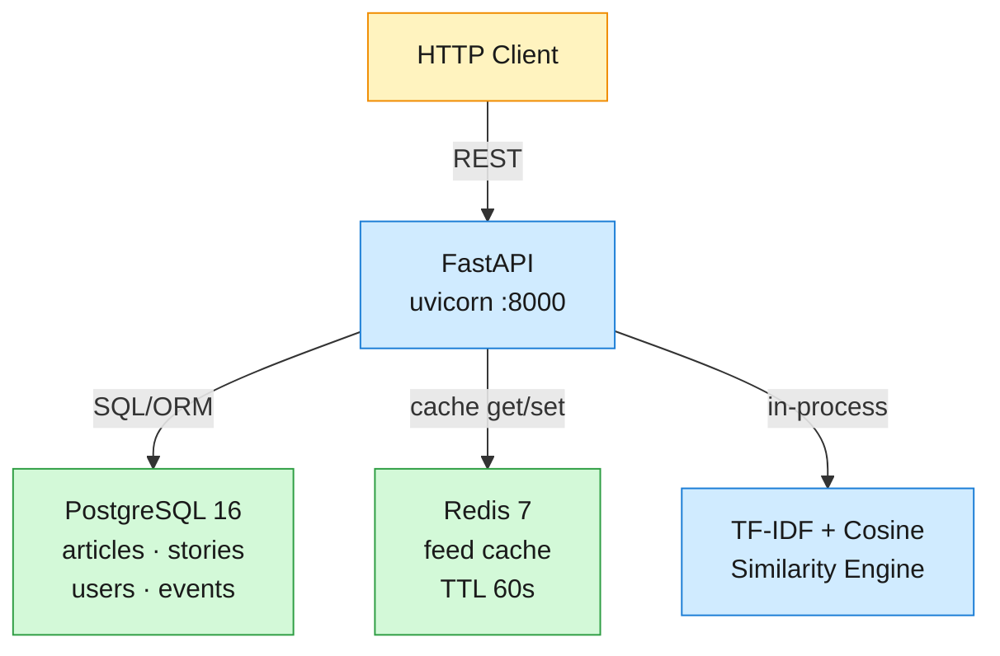

# Google News MVP — Design

## Architecture

A single-service FastAPI monolith backed by PostgreSQL and Redis. Articles flow through four stages: **ingest → cluster into stories → rank per user → serve as feed**.



**Feed request path (FR-1):**

1. `GET /v1/feed?user_id=X` → router calls feed service
2. Check Redis for cached result (key `feed:{user_id}:{region}:{prefs_hash}`, TTL 60s)
3. On cache miss: load user preferences → query stories from the last 48 hours → score each story → sort → cache
4. Score = freshness_decay × authority_boost × topic_boost (see [Ranking Formula](#ranking-formula))
5. Return top N stories with headline, snippet, source count, and thumbnail placeholder

**Article ingestion path (FR-5):**

1. `POST /v1/articles` → validate body → check URL uniqueness (409 on duplicate)
2. Insert article row with `story_id = NULL`
3. Call cluster service: build TF-IDF matrix from the last 24 hours of articles, compute cosine similarity, assign to best-match story if > 0.35, otherwise create a new story
4. Update story aggregates (article_count, top_sources, canonical_headline)
5. Invalidate affected feed cache entries
6. Return `article_id` and `story_id`

## Key Decisions

| # | Decision | Alternatives | Rationale |
|---|---|---|---|
| 1 | **PostgreSQL FTS** over Elasticsearch | Elasticsearch, MeiliSearch | Zero ops overhead. GIN index on `tsvector` handles MVP corpus size. Transactions couple search index with article writes. Revisit at >100K articles. |
| 2 | **In-process TF-IDF** over distributed MinHash/LSH | MinHash+LSH, sentence-transformers | Simple, no new infrastructure. O(n²) is fine for MVP batch sizes (~hundreds of articles per 24h window). MinHash needed only at scale. |
| 3 | **Score-based ranking** over ML two-tower | Learned embeddings, collaborative filtering | MVP doesn't have enough engagement data for ML. Formula-based ranking (freshness × authority × topic boost) is transparent and tunable. |
| 4 | **Redis feed cache, TTL 60s** over event-driven-only | No cache, event-driven invalidation | Covers the common refresh pattern; 60s staleness is acceptable for news. Event-driven invalidation on new article bounds worst case. |
| 5 | **Static source_authority** over dynamic scoring | Dynamic reputation graph | MVP lacks sufficient engagement data for dynamic authority. Static scores from a curated list are sufficient. |
| 6 | **Threshold 0.35** for cosine similarity clustering | 0.2 (loose), 0.5 (tight) | Balances false merges vs false splits. Exposed as config for tuning with real data. |
| 7 | **user_id as header** over JWT/OAuth | JWT, OAuth2 | Explicitly out of scope. Simplest path for MVP; real auth comes in Phase 2. |
| 8 | **`src/google_news/` package** over flat `app/` | `app/`, `api/` | Prevents import ambiguity in tests. Standard FastAPI src-layout. |

## Data Model

Four entities in PostgreSQL, all managed by SQLAlchemy 2 async ORM + Alembic migrations.

```
Article
  article_id: UUID (PK)
  url: text (UNIQUE)             ← idempotency key; duplicate ingestion returns 409
  publisher_domain: text (INDEX)
  headline: text
  snippet: text
  published_at: timestamptz (INDEX)
  language: text                 ← ISO 639-1
  region: text
  source_authority: float        ← static score 0–1
  story_id: UUID (FK → Story)    ← assigned by clustering, nullable until clustered
  created_at: timestamptz

Story
  story_id: UUID (PK)
  canonical_headline: text       ← highest-authority article's headline
  article_count: integer
  top_sources: text[]            ← top 5 publisher domains by authority
  category: text                 ← inferred from TF-IDF top term
  first_published_at: timestamptz
  last_updated_at: timestamptz
  created_at: timestamptz

UserProfile
  user_id: UUID (PK)
  followed_topics: text[]        ← explicit topic interests
  followed_sources: text[]       ← explicit publisher preferences
  region: text
  language_prefs: text[]
  created_at: timestamptz

UserEvent
  user_id: UUID (PK)             ← partition key
  event_id: UUID (PK)
  article_id: UUID
  story_id: UUID
  event_type: text               ← impression | click | long_dwell | dismiss
  created_at: timestamptz
```

**Indexes:**

- GIN index on `to_tsvector('english', headline || ' ' || snippet)` for full-text search
- B-tree indexes on `publisher_domain`, `published_at`, `story_id`
- Unique constraint on `url` for idempotency

## Ranking Formula

Each story in the feed is scored by three multiplicative factors:

```
score = freshness_decay × authority_boost × topic_boost
```

**Freshness decay:** `e^(-λ × hours_age)` where `λ = 0.05` (half-life ≈ 14h). A 24h-old article scores ~0.30; 48h-old scores ~0.09.

**Authority boost:** `0.5 + 0.5 × source_authority`. A source with authority 0.0 gets baseline 0.5; a source with authority 1.0 gets full 1.0.

**Topic boost:** `1.0 + 0.3 × |followed_topics ∩ story_category|`. Zero topic matches → 1.0 (neutral). One match → 1.3. Two matches → 1.6. If the user has no followed_topics, always 1.0.

Feed assembly: load user preferences → query stories with `first_published_at > now() - 48h` → compute score per story → sort descending → take top N → cache in Redis.

## API Reference

### `GET /healthz`
Health check. Always available, no auth.

- **200** `{"status": "ok", "version": "0.1.0"}`

### `GET /v1/feed`
Ranked story feed for a user.

| Param | Type | Default | Description |
|---|---|---|---|
| `user_id` | UUID | required | Target user |
| `limit` | int | 30 | Max stories (≤ 50) |

- **200** `{"stories": [{story_id, canonical_headline, snippet, source_count, top_sources, category, published_at, score, thumbnail_url}], "user_id": "..."}`
- **404** if user_id not found
- **422** if user_id malformed

### `GET /v1/stories/{story_id}`
Story detail with canonical headline and source attribution.

- **200** `{story_id, canonical_headline, article_count, top_sources, category, first_published_at, last_updated_at}`
- **404** if story_id not found

### `GET /v1/stories/{story_id}/articles`
Paginated articles within a story, sorted by authority DESC then recency DESC.

| Param | Type | Default | Description |
|---|---|---|---|
| `limit` | int | 20 | Page size (≤ 50) |
| `offset` | int | 0 | Starting offset |

- **200** `{story_id, articles: [{article_id, headline, publisher_domain, source_authority, published_at, url}], total, limit, offset}`
- **404** if story_id not found

### `GET /v1/search`
Full-text search across article headlines and snippets.

| Param | Type | Default | Description |
|---|---|---|---|
| `q` | string | required | Search query |
| `from` | ISO-8601 | optional | Start of published_at range |
| `to` | ISO-8601 | optional | End of published_at range |
| `limit` | int | 20 | Max results (≤ 50) |

- **200** `{results: [{article_id, story_id, headline, snippet, publisher_domain, published_at, relevance}], query, total}`
- **200** with empty `results: []` on no match (not 404)
- **422** if `q` is empty or missing

### `POST /v1/articles`
Ingest a new article. Triggers clustering. Idempotent on URL.

- **Body:** `{url, headline, publisher_domain, published_at (ISO-8601), snippet?, language?, region?, source_authority?}`
- **201** `{article_id, story_id, url}`
- **409** `{"detail": "Article with this URL already exists", "existing_article_id": "..."}`
- **422** if required fields missing or malformed

### `POST /v1/user/preferences`
Update user topic and source preferences. Upserts user profile.

- **Body:** `{user_id, followed_topics?: [str], followed_sources?: [str], region?: str, language_prefs?: [str]}`
- **200** `{user_id, followed_topics, followed_sources, region, language_prefs}`
- **422** if user_id missing or malformed

### `POST /v1/events`
Log a user engagement event. Fire-and-forget.

- **Body:** `{user_id, article_id, story_id, event_type ("impression"|"click"|"long_dwell"|"dismiss")}`
- **202** `{"status": "accepted", "event_id": "..."}`
- **422** if required fields missing or invalid event_type

## Functional Requirements → Acceptance Tests

Each functional requirement maps to a black-box acceptance test in `verify/acceptance/`, run against the live system.

| FR | Test File | What It Verifies |
|---|---|---|
| FR-1 — View ranked feed | `test_fr1_feed.py` | `GET /v1/feed` returns 200 with ranked stories; freshness decay visible in scores; unknown user → 404; malformed UUID → 422 |
| FR-2 — Browse story coverage | `test_fr2_stories.py` | `GET /v1/stories/{id}` returns canonical headline + top_sources; `/articles` paginates with correct offset/limit |
| FR-3 — Search articles | `test_fr3_search.py` | `GET /v1/search` returns matching articles; time-range filter narrows results; empty results for no-match query |
| FR-4 — Manage preferences | `test_fr4_preferences.py` | `POST /v1/user/preferences` upserts profile; subsequent feed reflects topic boost for matched categories |
| FR-5 — Ingest articles | `test_fr5_ingest.py` | `POST /v1/articles` returns 201 with article_id + story_id; duplicate URL → 409; missing fields → 422 |
| FR-6 — Log engagement | `test_fr6_events.py` | `POST /v1/events` returns 202; event persists in database |
| FR-7 — Health check | `test_fr7_healthz.py` | `GET /healthz` returns 200 with `status: "ok"` |
| FR-8 — Article dedup & clustering | `test_fr8_clustering.py` | Two articles about the same event get the same story_id; unrelated article gets a different story_id |

## Test Results

CI re-runs the full suite on every push to `main`, every pull request, and daily on schedule. The badges below are the live source of truth:

[](https://github.com/iliazlobin/sd-google-news-backend-mvp/actions/workflows/ci.yml)
[](https://github.com/iliazlobin/sd-google-news-backend-mvp/actions/workflows/lint.yml)
[](https://github.com/iliazlobin/sd-google-news-backend-mvp/actions/workflows/functional.yml)

**CI (`ci.yml`):** Runs unit tests (`pytest tests/unit/ -v`) on every push, PR, and daily schedule. Uses PostgreSQL service container.

**Lint (`lint.yml`):** Runs `ruff check` and `ruff format --check` on every push, PR, and daily schedule.

**Functional (`functional.yml`):** Runs the full acceptance suite `pytest verify/acceptance/ -v` against a live app + PostgreSQL instance. Exercises every functional requirement end-to-end.

## Stack

| Component | Choice |
|---|---|
| Runtime | Python 3.12, FastAPI, uvicorn |
| Primary DB | PostgreSQL 16 (async via SQLAlchemy 2 + asyncpg) |
| Cache | Redis 7 |
| Search | PostgreSQL full-text search (GIN-indexed `tsvector`) |
| Clustering | scikit-learn TF-IDF + cosine similarity (in-process) |
| Migrations | Alembic |
| Config | pydantic-settings |
| Container | Docker Compose (app + db + redis) |
| Tests | pytest + httpx (white-box), pytest + httpx.ASGITransport (black-box acceptance) |

## Out of Scope

- **Real-time web crawling** — no crawler fleet, sitemap polling, or RSS ingestion. Articles are submitted via API.
- **ML-based ranking** — no two-tower model, collaborative filtering, or learned embeddings. Score formula only.
- **Push notifications** — no FCM/APNs integration. Feed is pull-only.
- **Multi-region deployment** — single PostgreSQL instance, single Redis instance. No replication.
- **Breaking news detection** — no cluster momentum or velocity-based alerting.
- **User authentication** — no JWT, OAuth, or API keys. User identity is a UUID header.
- **WebSub/sitemap integration** — no publisher push protocols.
