## 1. Problem frame
Google News aggregates articles from ~50,000 publisher sources worldwide, clusters coverage of the same story, personalizes a feed for each of ~200M daily active users, and delivers breaking news within seconds of publication. A user opens the app or site, sees a ranked feed of story clusters with headlines, snippets, and source attribution, and can drill into full coverage — every source reporting on that story. The system must ingest a firehose of newly published articles (~1B/day), deduplicate and cluster them in real time, rank clusters per-user by a blend of freshness, relevance, and authority, and serve localized editions across 60+ regions — all with sub-second feed latency. The core tension is recency vs relevance: a breaking story is the most important thing in the world for 15 minutes but worthless afterward, yet a user's long-term interests must not be drowned out by the news cycle.

```mermaid
graph LR
    A["Publishers<br/>50K sources"] --> B["Crawler Fleet<br/>sitemap polling"]
    B --> C["Ingestion Pipeline<br/>extract, normalize, enrich"]
    C --> D["Dedup & Clustering<br/>MinHash + LSH"]
    D --> E["Story Index<br/>clustered articles"]
    E --> F["Ranking Engine<br/>ML freshness + relevance"]
    F --> G["Serving Layer<br/>feed assembly, CDN"]
    G --> H["Clients<br/>Web, iOS, Android"]

    classDef edge fill:#fff3bf,stroke:#f08c00,color:#1a1a1a;
    classDef svc fill:#d0ebff,stroke:#1c7ed6,color:#1a1a1a;
    classDef store fill:#d3f9d8,stroke:#2f9e44,color:#1a1a1a;
    class B,C,D,F,G svc;
    class E store;
    class A,H edge;
```



## 2. Requirements
**Functional**
- FR1: View a personalized news feed ranked by freshness, relevance, and source authority
- FR2: Browse full coverage of a story across all reporting sources with source attribution
- FR3: Search for news by keyword, topic, or location with time-range filtering
- FR4: Follow specific topics, locations, or sources to tune the feed
- FR5: Receive breaking-news push notifications within 60 seconds of publication
- FR6: Access localized news editions for 60+ regions in their native language

**Non-functional**
- NFR1: Feed page load p95 under 200ms from CDN edge
- NFR2: New articles appear in story clusters within 30 seconds of crawl
- NFR3: 99.99% serving availability during major breaking-news spikes (10x normal traffic)
- NFR4: Feed personalization degrades gracefully — never returns empty for a logged-in user

**Out of scope:** publisher payment and revenue share, full-text article hosting (only snippets), user-generated content moderation, video/news broadcast integration, advertising and ad targeting infrastructure.

## 3. Back of the envelope
50K sources × 20 articles/day avg → 1M articles/day base; but 50K sources × 200 articles/day peak (breaking news triples output) → 10M articles during spike day. With 100+ words/article and extracted metadata, ~5 KB per article → 50 GB raw ingest/day. Implication: ingestion is write-heavy but moderate volume (~115 articles/s peak); the bottleneck is crawl scheduling, not storage bandwidth.

200M DAU × 1 feed refresh/session × 5 sessions/day → ~1B feed requests/day ≈ 12K QPS average, 50K QPS peak (morning commute). Each feed request assembles ~30 story clusters per user with headlines, snippets, and thumbnail URLs — ~10 KB per response → 500 MB/s egress at peak. Implication: feed assembly must be fast (p95 < 50ms server-side) and cacheable; serve from CDN edge with personalization stitched at the edge or via ESI (Edge-Side Includes).

1B articles/day ingested → ~50K new articles/min peak. Dedup must compare each incoming article against a rolling window of recent articles. Brute-force pairwise comparison is O(n²) at 50K/min — a non-starter. Implication: MinHash + LSH reduces comparison to O(n) by bucketing similar articles; the LSH index must support ~50K insertions/min and ~50K queries/min (each new article queries against the index to find its cluster).

## 4. Entities & API
```javascript
Article
  article_id: string (PK)          ← publisher domain + path hash, globally unique
  url: string (UNIQUE)             ← canonical URL after normalization
  publisher_domain: string (INDEX) ← e.g. "reuters.com"
  headline: string (TEXT INDEX)
  snippet: string                  ← first 200 chars of body, extracted
  published_at: timestamp (INDEX)
  language: string (INDEX)         ← ISO 639-1; drives region routing
  region: string (INDEX)           ← geo-tag from content + publisher locale
  source_authority: float          ← static score from publisher reputation graph

Story
  story_id: string (PK)            ← generated by LSH cluster assignment
  canonical_headline: string       ← highest-authority source's headline
  article_count: integer           ← number of articles in this cluster
  top_sources: string[]            ← top 5 publisher domains by authority
  category: string (INDEX)         ← top-1 topic label: world | business | tech | sports | ...
  first_published_at: timestamp    ← earliest article in cluster
  last_updated_at: timestamp       ← most recent article added
  is_breaking: boolean             ← true if cluster grew 5+ articles in 5 min
  cluster_momentum: float          ← article arrival rate; decays exponentially

UserProfile
  user_id: string (PK)
  language_prefs: string[]         ← e.g. ["en", "es"]
  region: string                   ← home region for local news
  followed_topics: string[]        ← explicit topic interests
  followed_sources: string[]       ← explicit publisher preferences
  interest_embedding: float32[]    ← 128-dim embedding from reading history; updated nightly

UserEvent
  user_id: string (PK)             ← partition key
  event_id: string (PK)            ← sort key
  article_id: string               ← article viewed
  story_id: string                 ← story cluster the article belongs to
  event_type: enum                 ← impression | click | long_dwell (>30s) | share | dismiss
  timestamp: timestamp
  session_duration_ms: integer
```

**API**
- GET /v1/feed?region=us&page_token=<token> — personalized news feed; returns ranked story clusters with headline, snippet, source count, thumbnail; 30 clusters per page
- GET /v1/stories/{story_id}?include=articles — full coverage of a story; returns canonical headline + all source articles sorted by authority and recency
- GET /v1/search?q=<query>&region=us&from=<ts>&to=<ts>&page_token=<token> — search across article index with optional time and region filters
- POST /v1/user/preferences — update followed topics, sources, and region
- POST /v1/events — log user interaction (impression, click, dwell, dismiss); fire-and-forget, 202 Accepted
- GET /v1/breaking?region=us — current breaking-news stories for a region
